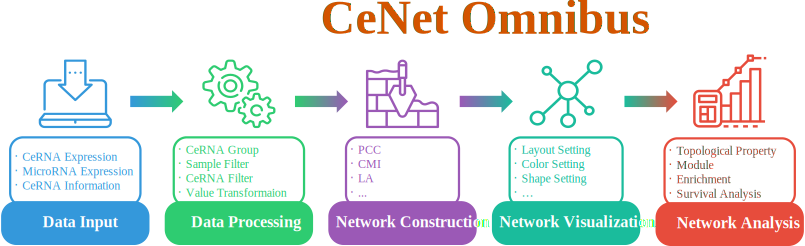
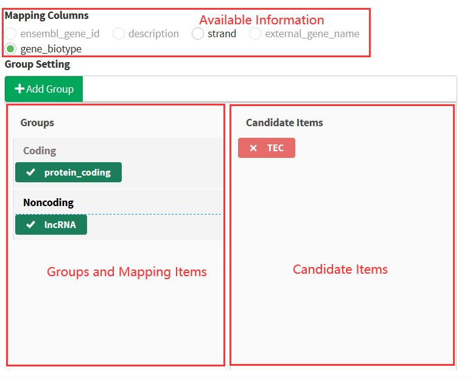
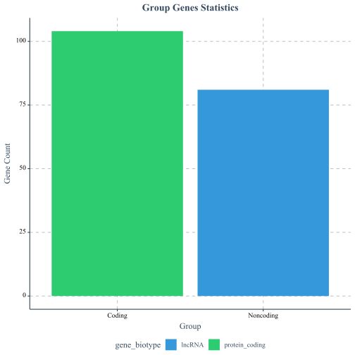
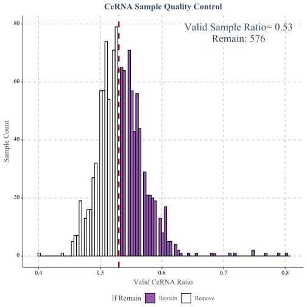
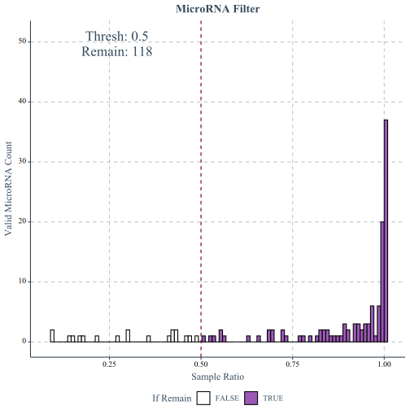
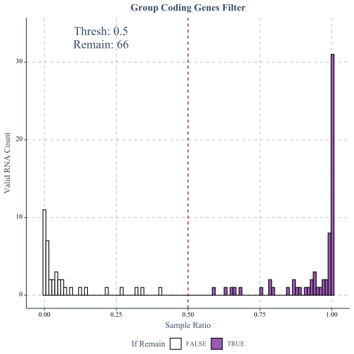
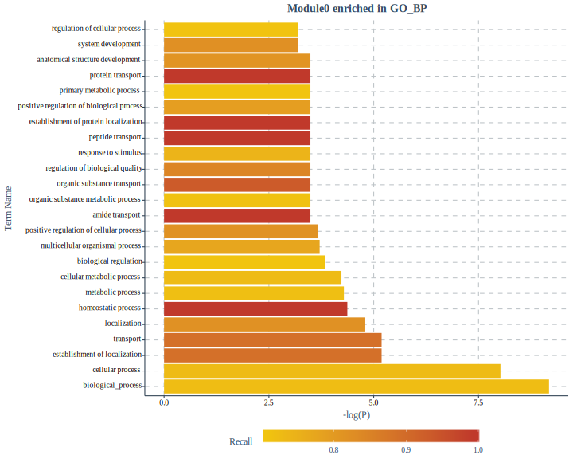
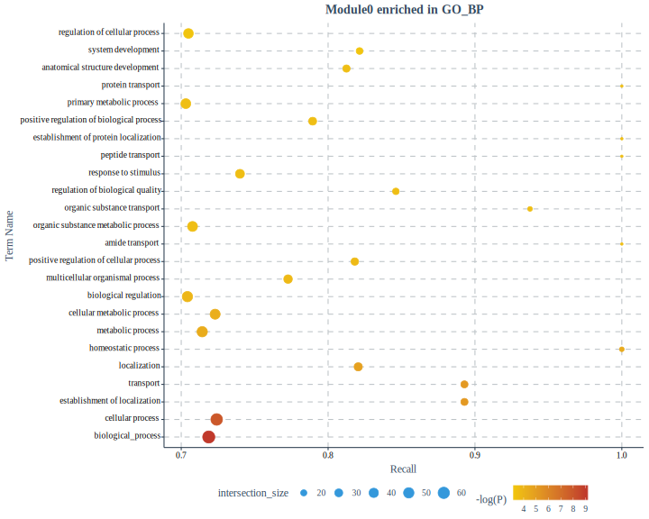
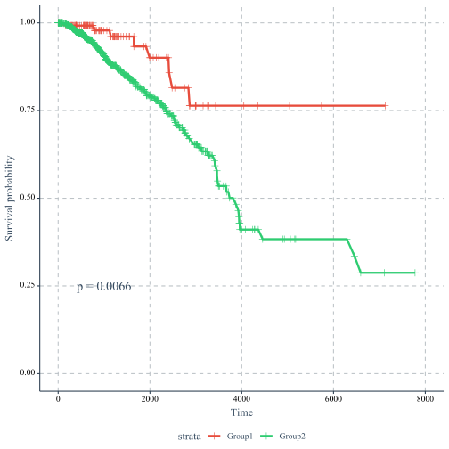

# CeNet Omnibus

## Introduction

The ceRNA regulation is a newly discovered post-transcriptional regulation mechanism and plays significant roles in physiological and pathological progress. The analysis of ceRNAs and ceRNA network has been widely used to detect survival biomarkers, select candidate regulators of disease genes, and pre-dict long noncoding RNA functions. However, there is no software platform to provide overall functions from construction to analysis of ceRNA networks. To solve this problem, we introduce CeNet Omnibus, a R/Shiny application, which provides a unified framework of ceRNA network construction and analysis. CeNet Omnibus is characterized by comprehensiveness, high efficiency, high expandability and user customizability, and it also offers the web-based user-friendly interface for users to obtain the output intuitionally in time.

CeNet Omnibus consists of five components, including **Data Input**, **Data Processing**, **Network Construction**, **Network Visualization** and **Netwoek Analysis**. The framework of CeNet Omnibus is shown below.



## How to Start

To install CeNetOmnibus package, please input the following commands in the console

```
devtools::install_github('GaoLabXDU/CeNetOmnibus')
```

CeNetOmnibus depends on multiple packages, including **biomaRt**, **circlize**, **colourpicker**, **ComplexHeatmap**, **DT**, **formattable**, **ggplot2**, **ggplotify**, **ggthemr**, **gprofiler2**, **igraph**, **infotheo**, **jsonlite**, **linkcomm**, **MCL**, **parallel**, **PerformanceAnalytics**, **plyr**, **ProNet**, **R.oo**, **rhandsontable**, **scales**, **shiny**, **shinydashboard**, **shinyWidgets**, **survival**, **survminer**, **svglite**, **tibble**, **visNetwork**.

To make sure all the dependency packages are installed, run  following codes to install dependency packages.

```r
library(CeNetOmnibus)
checkDependency()
```

## Data Preparation

CeNet Omnibus demands users to upload four files for the constrction of ceRNA network, including

- The expression profiles of candidate ceRNAs and microRNAs
- The interaction between microRNA and candidate ceRNAs
- Essential information of candidate ceRNAs, eg. symbols, biotypes, and etc.

## Get Start

The following commands should be used to start CeNet Omnibus.

```r
library(CeNetOmnibus)
CeNetOmnibus()
```

### 1. Data Input

**Data input** provides the interface for users to upload data for the construction of ceRNA network. The demo data can be found in [demodata.zip](https://github.com/william0701/ceNet-Omnibus/releases/download/0.1.1/demodata.zip)

#### 1.1 Expression Profiles

The expression profiles of ceRNAs and microRNAs should be plain text delimited by tab, comma, space, semicolon or any other prac-ticable marks. Users can set seperators, quotes, with/without headers. To name the datasets, please confirm if the program should name dataset with/without the first column. The rows of uploaded files should represent ceRNAs/microRNAs, while the columns should represent samples.

<center><b>CeRNA Expression Profile Samples</b></center>

|                 | TCGA\.3C\.AAAU\.01 | TCGA\.3C\.AALI\.01 | TCGA\.3C\.AALJ\.01 | TCGA\.3C\.AALK\.01 | TCGA\.4H\.AAAK\.01 |
| --------------- | ------------------ | ------------------ | ------------------ | ------------------ | ------------------ |
| ENSG00000275454 | 0\.35              | 0\.13              | 0\.25              | 0\.23              | 0\.2               |
| ENSG00000261519 | 0\.06              | 0\.04              | 0\.07              | 0\.01              | 0\.09              |
| ENSG00000267405 | 0\.03              | 0\.18              | 0\.15              | 0\.13              | 0                  |
| ENSG00000115365 | 25\.05             | 9\.96              | 8\.47              | 11\.39             | 15\.6              |
| ENSG00000274395 | 0\.05              | 0                  | 0\.09              | 0\.13              | 0\.42              |
| ENSG00000177272 | 0\.13              | 0\.49              | 0\.22              | 0\.33              | 0\.13              |
| ENSG00000235142 | 0\.05              | 0\.01              | 0\.03              | 0\.03              | 0                  |

<center><b>CeRNA Expression Profile Samples</b></center>

| mirbase21\_ID | TCGA\.BH\.AB28\.01 | TCGA\.AO\.A128\.01 | TCGA\.A1\.A0SD\.01 | TCGA\.B6\.A0I1\.01 | TCGA\.BH\.A0BF\.01 |
| ------------- | ------------------ | ------------------ | ------------------ | ------------------ | ------------------ |
| MIMAT0002841  | 0\.745546          | 0                  | 0\.253132          | 0                  | 0                  |
| MIMAT0002840  | 0\.186387          | 0                  | 0                  | 0                  | 0                  |
| MIMAT0021122  | 0                  | 0                  | 0                  | 0                  | 0                  |
| MIMAT0021123  | 0                  | 0                  | 0                  | 0                  | 0                  |
| MIMAT0021120  | 0                  | 0                  | 0                  | 0                  | 0                  |
| MIMAT0021121  | 0                  | 0                  | 0                  | 0                  | 0                  |

> NOTE: Please Remeber to Click **Preview** Button on the right-bottom corner of the panel once set parameters properly.

#### 1.2 The Interaction between ceRNAs and microRNAs

The interactions file between ceRNAs and microRNAs should be 0-1 matrix to represent if there are interactions between ceRNAs and microRNAs. The file should be plain text delimited by tab, comma, space, semicolon or any other prac-ticable marks. Users can set seperators, quotes, with/without headers. To name the datasets, please confirm if the program should name dataset with/without the first column. The rows of uploaded files should represent ceRNAs, while the columns should represent microRNAs.

<center><b>CeRNA Expression Profile Samples</b></center>

|                 | MIMAT0000646 | MIMAT0002809 | MIMAT0000617 | MIMAT0000266 | MIMAT0000264 | MIMAT0000263 | MIMAT0000261 | MIMAT0005951 | MIMAT0000278 |
| --------------- | ------------ | ------------ | ------------ | ------------ | ------------ | ------------ | ------------ | ------------ | ------------ |
| ENSG00000275454 | 1            | 1            | 0            | 1            | 0            | 1            | 1            | 1            | 1            |
| ENSG00000261519 | 1            | 0            | 0            | 1            | 1            | 1            | 0            | 1            | 0            |
| ENSG00000267405 | 0            | 1            | 0            | 1            | 1            | 1            | 1            | 0            | 0            |
| ENSG00000115365 | 1            | 1            | 1            | 1            | 1            | 1            | 1            | 1            | 1            |
| ENSG00000274395 | 1            | 0            | 1            | 0            | 1            | 1            | 1            | 0            | 1            |
| ENSG00000177272 | 1            | 1            | 1            | 1            | 1            | 1            | 1            | 0            | 1            |
| ENSG00000235142 | 1            | 1            | 1            | 1            | 1            | 1            | 1            | 1            | 1            |

> NOTE: Please Remeber to Click **Preview** Button on the right-bottom corner of the panel once set parameters properly.

#### 1.3 Essential ceRNA Information

The Enssential ceRNA Information will be used to group ceRNAs and set network/module visualization

The Essential ceRNA Information can be supplied by two ways:

- **Biomart Download**

- **Custom Upload**

For **Biomart Download** method, users can select Ensembl Archieve, Species, Gene ID Type, and search items in the Ensembl Database. Users are able to select a part of ceRNAs in the input datasets.

For **Custom Upload** method, the uploaded file should be plain text delimited by tab, comma, space, semicolon or any other prac-ticable marks. Users can set seperators, quotes, with/without headers. To name the datasets, please confirm if the program should name dataset with/without the first column. The rows of uploaded files should represent ceRNAs, while the columns should represent the information of ceRNAs. The first column of the uploaded file should be the ceRNA identifiers.

<center><b>CeRNA Information Samples</b></center>

|                 | ensembl\_gene\_id | description                                                                | strand | external\_gene\_name | gene\_biotype    |
| --------------- | ----------------- | -------------------------------------------------------------------------- | ------ | -------------------- | ---------------- |
| ENSG00000006377 | ENSG00000006377   | distal\-less homeobox 6 \[Source:HGNC Symbol;Acc:HGNC:2919\]               | 1      | DLX6                 | protein\_coding  |
| ENSG00000010361 | ENSG00000010361   | fuzzy planar cell polarity protein \[Source:HGNC Symbol;Acc:HGNC:26219\]   | \-1    | FUZ                  | protein\_coding  |
| ENSG00000010438 | ENSG00000010438   | serine protease 3 \[Source:HGNC Symbol;Acc:HGNC:9486\]                     | 1      | PRSS3                | protein\_coding  |
| ENSG00000036054 | ENSG00000036054   | TBC1 domain family member 23 \[Source:HGNC Symbol;Acc:HGNC:25622\]         | 1      | TBC1D23              | protein\_coding  |
| ENSG00000047249 | ENSG00000047249   | ATPase H\+ transporting V1 subunit H \[Source:HGNC Symbol;Acc:HGNC:18303\] | \-1    | ATP6V1H              | protein\_coding  |
| ENSG00000056998 | ENSG00000056998   | glycogenin 2 \[Source:HGNC Symbol;Acc:HGNC:4700\]                          | 1      | GYG2                 | protein\_coding. |

> NOTE: Please Remeber to Click **Preview** Button on the right-bottom corner of the panel once set parameters properly.

> WARNING: The Biomart Download may take relatively longer time, especially for the users on the Chinese Mainland.

### 2. Data Processing

**Data Processing**  provide the interface to *Group CeRNAs*, *Filter Bad Samples*, *Filter Non-Expressed MicroRNAs/CeRNAs* and *Value Transformation*. 

When enter the **Data Processing** tab, the program will obtains the common ceRNAs, microRNAs and samples in the uploaded  files.


#### 2.1 Gene Grouping

Users are allowed to group ceRNAs into different groups to set different paramenters for the ceRNA filter and network construction. For example, the non-coding RNAs, especially long non-coding RNAs (lncRNAs)  usually have relatively lower expression levels. The thresh of non-expressed lncRNAs may be lower than that of mRNAs.

Users can group ceRNAs according to the essential ceRNA information uploaded in step 1.3.  Validated columns are listed. 



> NOTE: Click **Preview** Button on the right-bottom corner of the panel once set parameters properly.

> NOTE: The ceRNAs of non-selected items will be removed in the next processing.



#### 2.2 Sample Filter

There may be some bad samples in the ceRNA/microRNA expression profiles. This section allows users to remove these bad samples.

Firstly, users should set the thresh of a good microRNA/ceRNA in samples. For example, we think the CPM of a microRNA larger than 50 is good, while the RPKM of a ceRNA larger than 0.1 is good. Then, the program will calculate the good microRNAs/ceRNAs ratio each sample, and create the distribution plot. Finally, users need to decide how many samples should be remained by sliding the percentile bar.




> NOTE: Click **Preview** to create the plot, and the change of Percentile bar will update the plot.

> NOTE: Please Remeber to Click **Filter** Button on the right-bottom corner of the panel once set parameters properly to execute the Sample Filter.

#### 2.3 RNA Filter

Because the expressions of ceRNAs and microRNAs have tissue-specificity, non-expressed microRNAs and ceRNAs should not appear in the ceRNA networks. This section allow users to remove non-expressed microRNAs and ceRNAs.

Firstly, users should set the minimal expression thresh of a expressed microRNA or ceRNA . For example, we think the CPM of a microRNA larger than 100 is expressed, while the RPKM of a noncoding ceRNA larger than 0.5 is expressed and 1 for a coding ceRNA. Then, the program will calculate the expressed sample ratio of each RNA, and create the distribution plot. Finally, users need to decide how many samples a RNA  should express in by sliding the Minimal Sample Ratio bar.







> Tips: Click **Preview** to create the plot, and the change of Percentile bar will update the plot.

> NOTE: Please Remeber to Click **Filter** Button on the right-bottom corner of the panel once set parameters properly to execute the RNA Filter.

#### 2.4 Value Transformation

We may need to perform some transformation operations on the CeRNA and MicroRNA matrices. In this step, we operate CeRNA by default. You can also choose MicroRNA. Their operation method is the same.

In Transform Operations, you can choose to perform log conversion or standardization. Hovering the mouse over each button will introduce detailed processing operations. It should be noted that we only allow log conversion first, or you can ignore the log step and standardize directly. Remember to click the Action button after the operation. If you are not satisfied with the operation, you can click the Cancel button to restore the original data.

Note the Custom button. If you want to write a function to perform data conversion, you can click it. There will be detailed examples in the pop-up interface for you to write functions.


> Tips: Our operation will not be iterative. If you click the Action button again, it will perform the operation you selected on the initial data.

### 3. Network Construction

CeNet Omnibus  provides a set measurements for users to identify ceRNA pairs and construct ceRNA networks. Current version integrated 5 measurements, including Pearson Correlation Coefficient, liquid association,  microRNA significance, mutual information, conditional mutual information. CeNet Omnibus also allows users to defined new measurements. 

**Network Construction** provide the interface to *Choose Measurements*, *Set Parameters* and *Construct Network*.

#### 3.1 Choose Measurement

Click **Add New** Button to add a new measurement. Users need to set how many CPU cores ared needed to compute this measurement. Additionally, users can select if they want to compute the measurement of all pairs or a part of pairs according to the ceRNA groups defined in section 2.1. 


Click Start Btn to  start calculation. When the calculation is finished, the background color will be Green


> TIPS: PCC only need one core to compute. 

#### 3.2 Set Threshold

When the calculation is finished, the program will create the distribution plot of every task.


**Direction** can set which part of pairs should be remained. **+** and **-** can be used to tune the thresh value with step in **Step**

After all settings, click **Confirm** button to save the threshes.

> Tips: If you want all pairs to share the common thresh, please select **All** in section 3.1. While you want to set every group pair with different threshes,   please select the group pairs seperately.

#### 3.3 Network Construction

After saving all the threshes, Click **Construct Network** button to create the ceRNA network. The program will apply all the threshold setted in section 3.2. The program will summarize the network after the  constrction.


### 4. Network Visualization

#### 4.1 Choose Layout

We provide seven layouts for you to choose. Including: *Circle*, *Random*, *Grid*, Concentric, *Breadth First* and *Cose*.

> NOTE:  The network needs to be constructed in the third step before selecting the layout.

#### 4.2 Change Gene Name

You can choose to change the name tag of the network node. The optional entry is the gene information you provided in section 1.3.

#### 4.3 Choose Node Color

First select the grouping information you are interested in. After the selection, the group names of the nodes under the grouping condition will appear. You can change the color of each group of nodes as will. By default, it changes the color of all nodes.

#### 4.4 Choose Node Shape

Same as the previous step, you can change the shape of each node. We provide eight different shapes, such as Exlipse, Star.

#### 4.5 Select node

First select the group that the node name belongs to, and then enter exactly the information of the node you need to search. If you can't find it, a prompt will pop up. If the search is successful, the node will enter the selected state. The label of the node will show another color. You can move the node by mouse.

> Tips: Make sure the group you choose matches the one in Change Gene Name

#### 4.6 Reset network

Clicking this button will restore the location of the network to prevent mouse misoperations from moving the network out of the window. Note that this button only restores the location of the network. The color, shape, etc. will not change.

#### 4.7 Export Network

Export the visualized network in the fourth page as a image


### 5. Network Analysis

CeNet Omnibus provide four types of analysis to ceRNA network, including **Network Topological Property**, **Network Module**, **Enrichment Analysis** and **Survival Analysis**.

#### 5.1 Network Topological Property

CeNet Omnibus can calculate four node centralities and one edge centrality to evaluate the network topological properties. Users only need to click the corresponding buttons to create the density plot of every centrality.

 


> Tips: Click **Detail** button to get detail information

#### 5.2 Network Module

CeNet Omnibus integrated a set of network module detection algorithms to identify ceRNA modules, including Louvain Method, MCL, MCODE, etc.

CeNet Omnibus will summarize the communities in a table. Users can select modules to visualize and set node properties with the similar way in section 4.


#### 5.3 Enrichment Analysis

Here we can perform enrichment analysis to these modules. Sure, you can also analyze other genes sets, by choosing **Gene Set Source** as **Custom Gene** and inputing data as required.

Currently, CeNet Omnibus integrates **g:Profiler** to do function enrichment analysis. Besides, CeNet Omnibus allows users to provide custom defined gene sets to other analysis. For user-defined data sets,  users should choose **custom input**, and upload a gene sets file. In this file, every line represents a gene set, seperated with tab. And the first element in every line should be the name of the gene set. Users can click **Preview** to check the uploaded file. The results will be shown in the **Custom Gene Preview** panel. Users can click **Details** button to view genes in corresponding gene sets.


The following is the parameter introduction:

**Organism**: Select species for input data.

**Gene ID Map**:Select Gene ID for input data.

**Significance threshold**: Select enrichment calculation method.

**Data Sources**:choose the data sources of interest（See R package: gprofiler2 for more details）

**User threshold**:defines a custom p-value significance threshold for the results.

**Module analysis**:Choose which modules to analyze.

**Plot Type**:Select the type of picture to display.

You should confirm all parameter Meet your requirements. Finally click **Perform** Button. You will see pictures.




> NOTE: You need to make sure that there are values at the top of the 2nd Step and **Network Modules** on 5th Step have been completed.Otherwise,**Gene ID Map** and **Module analysis** will be empty.

#### 5.4 Survival Analysis

CeNet Omnibus provides the interface to perform survival analysis. There are two models, including Kaplan-Meier survival estimate model and Cox proportional hazards regression model. 


Users need to upload the clinical information and corresponding expression profiles. Alternatively, the expression profiles can be the expreesion profiles used to construct ceRNA network. The program will obtain the patients that appear in both data sets. Therefore, please make sure the patient ids are in the same format in two data sets.

Users need to set parameters for the estimation models. CeNet Omnibus can analyze survival hazard of gene set or single gene.




## Download

CeNet Omnibus allows users to download every plot. But, for the plots of enrichment analysis and survival analysis, users should click the Download or Export button **Twice** to download the plots (we have not found the solution to solve this problem). In addition, users need to ensure that the system supports **zip/unzip** command.
